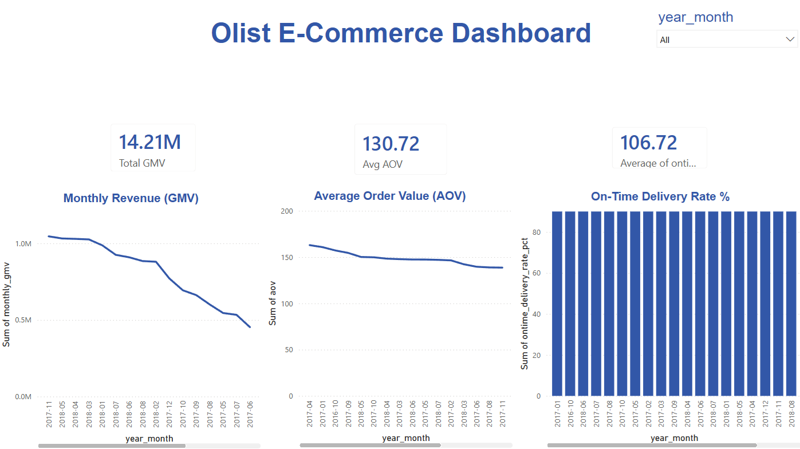

# Olist E-Commerce Data Pipeline

End-to-end data pipeline for the [Brazilian E-Commerce (Olist) dataset](https://www.kaggle.com/datasets/olistbr/brazilian-ecommerce) covering ~100,000 orders from Sep 2016 to Aug 2018.

---

## Architecture Overview

```
Kaggle CSV Files
      │
      ▼
[Part 1] Prefect ETL Pipeline
  Extract → Cast → DQ Check → Load
      │
      ▼
[Part 2] BigQuery Data Warehouse
  Staging → Intermediate → Mart → KPI Views
      │
      ▼
[Part 3] Power BI Dashboard
  DAX Measures → KPI Cards → Time-series Charts
```

---

## Part 1 — ETL Pipeline & Orchestration (Prefect)

### Stack
- **Orchestrator:** Prefect
- **Language:** Python 3.11
- **Destination:** Google BigQuery (`olist_staging` dataset)

### Pipeline Flow

```
process_orders()        → extract → cast → dq_check → load stg_orders
process_order_items()   → extract → cast → dq_check → load stg_order_items
process_payments()      → extract → cast → dq_check → load stg_payments
```

Each task uses `@task` decorator and the main flow uses `@flow(name="olist-etl-pipeline")`.
Every step logs row counts — e.g. `"Orders DQ: 99441 in, 99441 passed, 0 rejected"`.

### Data Quality Checks (before load)

| Table | Check | Action |
|-------|-------|--------|
| stg_orders | Null `order_id` or `customer_id` | Log warning + reject row |
| stg_order_items | Null `order_id` or `price <= 0` | Log warning + reject row |
| stg_payments | Null `order_id` | Log warning + reject row |

Flow does **not crash** on bad rows — rejects them and logs count, then continues loading clean rows.

---

## Part 2 — DWH Modeling in BigQuery

### BigQuery Dataset

- **Project:** `project-839c799e-2b34-4fae-814`
- **Dataset:** `olist_staging`

### Layer Design

```
staging/
├── stg_orders              ← raw orders, cast + cleaned
├── stg_order_items         ← raw items, price cast to float
└── stg_payments            ← raw payments

intermediate/
└── int_orders_enriched     ← JOIN orders + items + payments
                               + delivery_lead_time_days
                               + is_ontime flag

mart/
├── mart_daily_revenue      ← daily aggregated KPI table
├── vw_total_gmv            ← monthly GMV view
├── vw_avg_aov              ← monthly AOV view
└── vw_ontime_delivery_rate ← monthly on-time rate view
```

### Layer Rationale

- **Staging** — raw data loaded as-is from CSV with type casting only. No business logic. Makes debugging easy if source data changes.
- **Intermediate** — orders joined with items and payments. Enriched with `delivery_lead_time_days` (DATE_DIFF) and `is_ontime` flag (CASE WHEN). Separates join logic from aggregation logic.
- **Mart** — daily aggregated table with raw counts (`ontime_orders`, `total_delivered_orders`). Stores counts not pre-averaged floats — ensures correct weighted aggregation at any granularity in BI.
- **KPI Views** — thin views on top of mart grouping by `year_month`. Keeps BI queries simple and fast without hitting raw tables directly.

### Null Strategy

| Column | Issue | Decision |
|--------|-------|----------|
| `product_category_name` | ~1,600 nulls | Kept — dropping would undercount revenue |
| `order_delivered_customer_date` | Null for undelivered orders | Excluded from on-time rate using `WHERE order_status = 'delivered'` — null ≠ late |
| `order_id` | Null = invalid row | Rejected at DQ layer before loading |
| `price <= 0` | Invalid transaction | Rejected at DQ layer before loading |

---

## Part 3 — BI Dashboard & DAX

### Dashboard Preview

[](bi/dashboard.png)

### KPI Results (verified against BigQuery)

| KPI | Value | Calculation |
|-----|-------|-------------|
| Total GMV | 14.21M BRL | SUM of all order prices |
| Avg AOV | 142.89 BRL | Total GMV ÷ Total orders |
| On-Time Delivery Rate | 92.15% | 106,004 on-time ÷ 115,038 delivered |

### DAX Measures (`bi/dax_measures.md`)

**AOV** — pulls directly from mart, responds to date slicer:
```dax
Avg AOV = DIVIDE(SUM(mart_daily_revenue[gmv]), SUM(mart_daily_revenue[total_orders]))
```

**On-Time Delivery Rate %** — weighted rate, not simple average:
```dax
Avg Ontime Rate % =
    DIVIDE(
        SUM(mart_daily_revenue[ontime_orders]),
        SUM(mart_daily_revenue[total_delivered_orders])
    ) * 100
```

Measures used instead of calculated columns because they evaluate dynamically based on filter/slicer context. `DIVIDE()` used over `/` to safely handle division by zero.

---

## Setup & Run

### 1. Install dependencies

```bash
py -3.11 -m pip install -r requirements.txt
```

### 2. Authenticate with Google Cloud

```bash
gcloud auth application-default login
```

### 3. Place CSV files

Download from [Kaggle](https://www.kaggle.com/datasets/olistbr/brazilian-ecommerce) and place in `C:\olist_project\data\`:
- `olist_orders_dataset.csv`
- `olist_order_items_dataset.csv`
- `olist_order_payments_dataset.csv`

### 4. Run the pipeline

```bash
py -3.11 pipelines/flow.py
```

This extracts 3 CSVs → casts types → runs DQ checks → loads to BigQuery staging tables.

### 5. Run SQL models in BigQuery

Run in order:
1. `sql/intermediate/int_orders_enriched.sql`
2. `sql/mart/mart_daily_revenue.sql`
3. `sql/mart/vw_total_gmv.sql`
4. `sql/mart/vw_avg_aov.sql`
5. `sql/mart/vw_ontime_delivery_rate.sql`

---

## Project Structure

```
olist-data-pipeline/
├── pipelines/
│   ├── flow.py               # Prefect @flow — main orchestration
│   └── tasks/
│       ├── extract.py        # extract_csv()
│       ├── cast.py           # cast_orders(), cast_order_items(), cast_payments()
│       ├── dq_check.py       # dq_check_orders(), dq_check_order_items(), dq_check_payments()
│       └── load.py           # load_to_bigquery()
├── sql/
│   ├── staging/              # stg_orders, stg_order_items, stg_payments
│   ├── intermediate/         # int_orders_enriched
│   └── mart/                 # mart_daily_revenue + 3 KPI views
├── bi/
│   ├── dashboard.pbix        # Power BI dashboard
│   ├── dashboard.png         # Dashboard screenshot
│   └── dax_measures.md       # DAX formulas + explanation
├── requirements.txt
└── README.md
```

---

## Data Source

[Brazilian E-Commerce Public Dataset by Olist](https://www.kaggle.com/datasets/olistbr/brazilian-ecommerce) — Kaggle (do not commit CSV files to repo)
